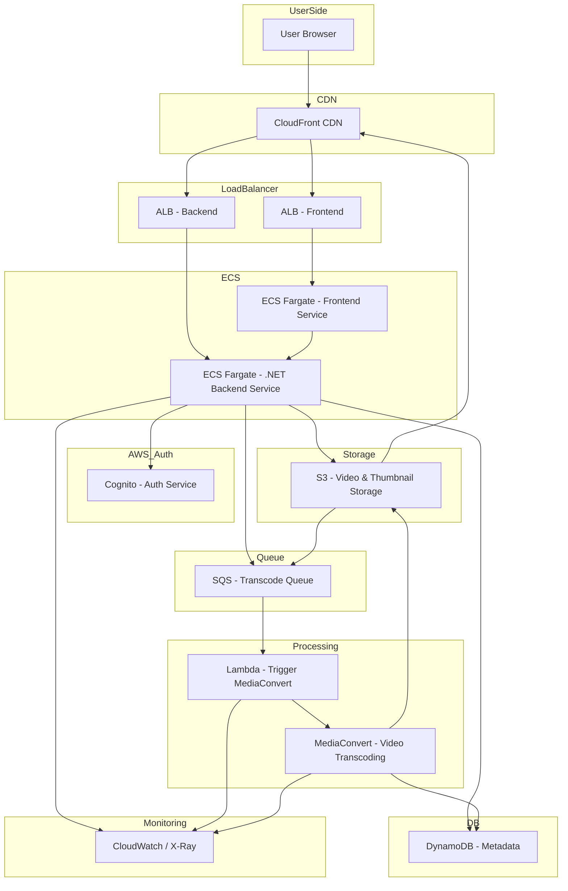

# Frontend Video Sharing Platform

Nền tảng chia sẻ video hiện đại được xây dựng với Next.js 15, TypeScript và Tailwind CSS.

## 🚀 Tính năng chính

- **Xem video**: Trình phát video với giao diện thân thiện
- **Tìm kiếm**: Tìm kiếm video theo từ khóa
- **Xác thực**: Đăng nhập/đăng ký người dùng
- **Upload video**: Tải lên video mới
- **Responsive**: Giao diện tối ưu cho mọi thiết bị
- **Dark mode**: Giao diện tối hiện đại

## 🛠 Công nghệ sử dụng

- **Framework**: Next.js 15 (App Router)
- **Language**: TypeScript
- **Styling**: Tailwind CSS v4
- **Icons**: Lucide React
- **HTTP Client**: Axios
- **Video Streaming**: Amazon IVS Web Broadcast
- **Containerization**: Docker

## 📁 Cấu trúc thư mục

```
src/
├── app/                    # App Router: pages & layouts
│   ├── auth/              # Trang xác thực (login, register)
│   ├── profile/[id]/      # Trang profile người dùng
│   ├── search/            # Trang tìm kiếm
│   ├── setting/           # Trang cài đặt
│   ├── upload/            # Trang upload video
│   ├── watch/[id]/        # Trang xem video
│   ├── layout.tsx         # Layout chính
│   └── page.tsx           # Trang chủ
├── components/            # Shared components
│   ├── Header.tsx         # Header navigation
│   ├── SideBar.tsx        # Sidebar navigation
│   ├── VideoCard.tsx      # Card hiển thị video
│   ├── VideoPlayer.tsx    # Trình phát video
│   └── ...
├── context/               # React Context
│   └── SidebarContext.tsx # Context quản lý sidebar
├── hooks/                 # Custom hooks
├── lib/                   # Helper functions & API clients
│   ├── axiosClient.ts     # Axios configuration
│   ├── mockData.ts        # Mock data cho development
│   └── videoApi.ts        # Video API functions
├── types/                 # TypeScript type definitions
│   ├── video.d.ts         # Video types
│   ├── user.d.ts          # User types
│   └── ...
├── styles/                # CSS/SCSS files
└── utils/                 # Utility functions
    └── cn.ts              # Class name utilities
```

## 🎨 Quy tắc thiết kế

### UI Guidelines
- Sử dụng **Tailwind CSS** cho toàn bộ styling
- Component dùng chung đặt trong `components/`
- Giữ component nhỏ, tái sử dụng, có type rõ ràng
- Ưu tiên dùng **shadcn/ui** và icon từ **lucide-react**

### Naming Conventions

| Loại            | Quy tắc                   | Ví dụ                 |
|-----------------|---------------------------|-----------------------|
| Component       | PascalCase                | `VideoCard.tsx`       |
| Hook            | camelCase + tiền tố `use` | `useFetchData.ts`     |
| Thư mục         | kebab-case                | `video-list/`         |
| Biến môi trường | CHỮ HOA + GẠCH DƯỚI       | `NEXT_PUBLIC_API_URL` |

## 🚀 Cài đặt và chạy

### Prerequisites
- Node.js 20+
- npm/yarn/pnpm

### Development

```bash
# Clone repository
git clone <repository-url>
cd frontend-video-sharing-platform

# Cài đặt dependencies
npm install

# Chạy development server
npm run dev
```

Mở [http://localhost:3000](http://localhost:3000) để xem ứng dụng.

### Production Build

```bash
# Build ứng dụng
npm run build

# Chạy production server
npm start
```

### Docker

```bash
# Build Docker image
docker build -t video-sharing-platform .

# Chạy container
docker run -p 3000:3000 video-sharing-platform
```

## 📱 Trang và tính năng

### Trang chủ (`/`)
- Hiển thị danh sách video trending
- Grid layout responsive
- Video cards với thumbnail, title, author

### Xem video (`/watch/[id]`)
- Video player với controls
- Thông tin video và channel
- Danh sách video liên quan
- Like/Subscribe buttons

### Xác thực (`/auth`)
- **Login** (`/auth/login`): Đăng nhập với email/password
- **Register** (`/auth/register`): Đăng ký tài khoản mới

### Upload (`/upload`)
- Upload video mới (đang phát triển)

### Profile (`/profile/[id]`)
- Thông tin channel
- Danh sách video của channel

## 🔧 API và Data

### Mock Data
Hiện tại sử dụng mock data trong `src/lib/mockData.ts`:
- `mockVideos`: Danh sách video mẫu
- `mockUser`: Danh sách user mẫu
- Helper functions: `getVideoById`, `getUserById`, `getRelatedVideos`

### API Integration
- Axios client được cấu hình trong `src/lib/axiosClient.ts`
- Video API functions trong `src/lib/videoApi.ts`

## 🏗 Kiến trúc hệ thống



## 🔮 Roadmap

### Phase 1 (Hiện tại)
- ✅ Giao diện cơ bản
- ✅ Video player
- ✅ Authentication UI
- ✅ Responsive design

### Phase 2 (Sắp tới)
- 🔄 Backend API integration
- 🔄 Real authentication
- 🔄 Video upload functionality
- 🔄 User profiles

### Phase 3 (Tương lai)
- 📋 Comments system
- 📋 Subscriptions
- 📋 Notifications
- 📋 Live streaming
- 📋 Analytics dashboard

## 🤝 Đóng góp

1. Fork repository
2. Tạo feature branch (`git checkout -b feature/AmazingFeature`)
3. Commit changes (`git commit -m 'Add some AmazingFeature'`)
4. Push to branch (`git push origin feature/AmazingFeature`)
5. Tạo Pull Request

## 📄 License

Distributed under the MIT License. See `LICENSE` for more information.

## 📞 Liên hệ

- **Email**: contact@videoshare.com
- **GitHub**: [Repository Link]
- **Demo**: [Live Demo Link]

---

**Built with ❤️ using Next.js 15 and TypeScript**